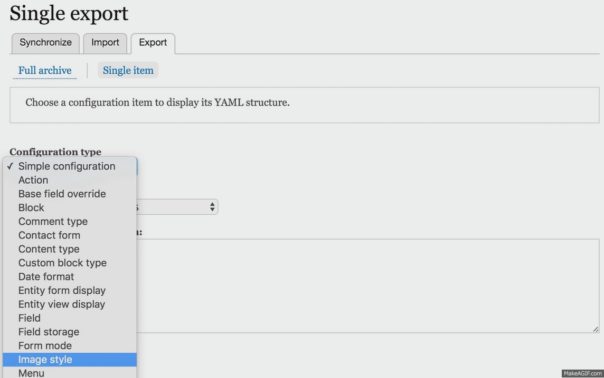
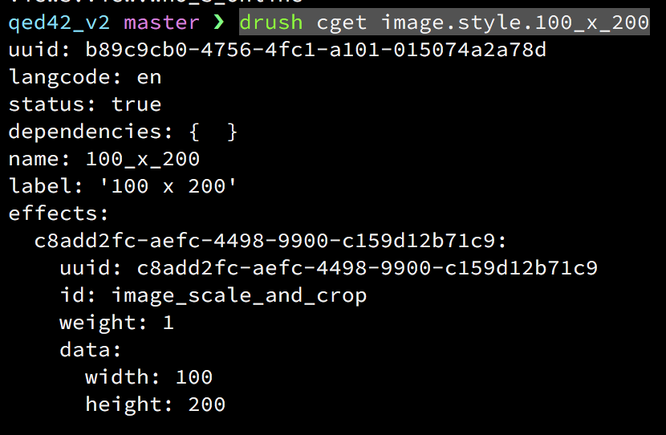

# Drupal 8 CMI

Separating config from content & being able to export config in code has always been a concern with Drupal. Solution to this started with the invent of features back in the days of Drupal 7 and has now become an integral part of Drupal 8.

Drupal 8 allows us to export configuration as YAML files. These can later be imported into another Drupal 8 instance with an easy to use interface. In this article, we will be talkig about:
* How to import/export single configuration?
* How to perform a bulk export of all the configurations on a site?
* How to synchronize configuration in a dev > stage > prod workflow?


### Enabling the module:
The  first step to get started with CMI is to enable the **Configuration Manager** module that bundles with Drupal 8 core.


### Exporting/Importing Configuration:
The CMI interface gives us following 2 options for exporting the configuration:
* Exporting YAML files per component
* Exporting a config tarball of all the components


### How to synchronize configuration in a dev > stage > prod workflow?
**P.S.** To move configuration across instances, its necessary for the components to have the same UUID. So, dev/stage/prod instances need to be clones of each other. 

 *CMI is not built for synchronizing a component from qed42.com to example.com.*


To understand the process, lets assume we need to create an image style test it on dev & then push it across to both stage & prod. In a world without CMI, the process would be to create it on dev, test it & then recreate it again over the other instances(stage & prod). With CMI, the steps would be as follows:
* Create the sync directory to hold all the configurations.
```mkdir sites/defalult/files/sync```
* Configure the same under config_directories array in settings.php.
```
$config_directories = array(
    CONFIG_SYNC_DIRECTORY => __DIR__ . '/files/sync'
);
```
* Create the image style on dev instance & test it.(Lets say we created an image style to scale images to 100X200 & named it as 100 x 200)
* Browse to admin/config/development/configuration/single/export & select image style under configuration style. Choose the image style we created under configuration name drop-down.

Alternatively, we can use drush config commands to do the same:
drush cli: List all the available configurations
drush cget [config_name]: In our case, it would be  
```drush cget image.style.100_x_200```

* Copy this config & create a file with name image.style.100_x_200.yml inside sync directory created in 1st step.
* 